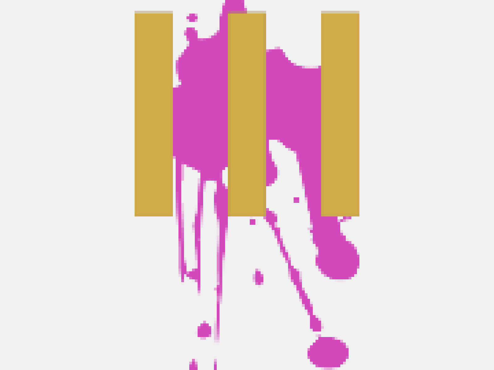

<h1 align="center">The Gamebuilder Metaverse</h1>

<a href="https://gotm.io/tribal/game-builder-metaverse">

</a>
href="https://github.com/sponsors/Tribal-III">

## Mission Statement

The Gamebuilder Metaverse aims to engage web 2.0 networks of creators with scalable, shared value. Our mission is to trade assets and contribute sandbox skills to create and maintain game worlds as content.

## Demo and Startup Instructions

Play our demo and learn how to get started:

- [Play the Demo](https://gotm.io/tribal/game-builder-metaverse)
- Follow these steps to start the Game:
  1. Step 1: Download the Game from [here](https://drive.google.com/file/d/1HJMQ3yvSYTD2r9mb22x5BDEYEVSi-K7_/view?usp=drivesdk)
  2. Step 2: Unzip it with your favorite extraction software
  3. Step 3: Play and have fun!

## Contributing

Please contribute using [GitHub Flow](https://guides.github.com/introduction/flow). Create a branch, add commits, and [open a pull request](https://github.com/rahuldkjain/github-profile-readme-generator/compare).

Please read [CONTRIBUTING](CONTRIBUTING.md) for details of the process for submitting pull requests to us.
Contributions are welcome! If you're interested in contributing, we have some easy starter issues to get you started.

- [Select character](https://github.com/TribaliiiGameDevelopment/CreationGame/issues/49).
- [Select World](https://github.com/TribaliiiGameDevelopment/CreationGame/issues/48)
- [Save player data](https://github.com/TribaliiiGameDevelopment/CreationGame/issues/47)
- [Set animations model for frontend](https://github.com/TribaliiiGameDevelopment/CreationGame/issues/45)

you can find more issues [here](https://github.com/TribaliiiGameDevelopment/CreationGame/issues) to contribute.

## Contributors ✨

<table border='1px'>
  <tr>
    <td>
      <a href="Github link" target="_blank">
        
        
Christian D.

      </a>
    </td>
    <td>
      <a href="Github link" target="_blank">
        
        
Austyn S.

      </a>
    </td>
    <td>
      <a href="Github link" target="_blank">
        
        
Kaia G.

      </a>
    </td>
    <td>
      <a href="Github link" target="_blank">
        
        
Daniel P.

      </a>
    </td>
    <td>
      <a href="Github link" target="_blank">
        
        
Janine K.

      </a>
    </td>
    <td>
      <a href="Github link" target="_blank">
        
        
Brandon C.

      </a>
    </td>
    <td>
      <a href="Github link" target="_blank">
        
        
Trung L.

      </a>
    </td>
    <td>
      <a href="Github link" target="_blank">
        
        
Jihad B.

      </a>
    </td>
  </tr>
<!-- 2   -->
  <tr>
    <td>
      <a href="Github link" target="_blank">
        
        
Dylan G.

      </a>
    </td>
   <td>
      <a href="Github link" target="_blank">
        
        
Jasmine B.

      </a>
    </td>
    <td>
     <a href="Github link" target="_blank">
        
        
Ikechukwu o.

      </a>
    </td>
    <td>
</table>

## License

This project is licensed under the [MIT](LICENSE).
